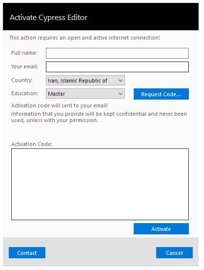
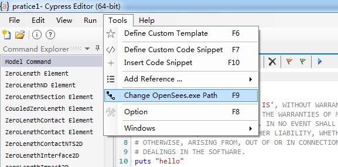
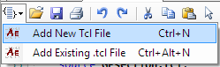
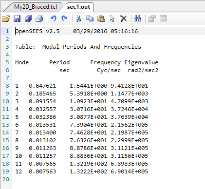
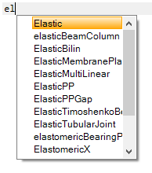
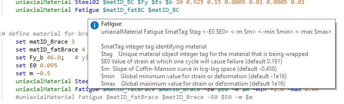
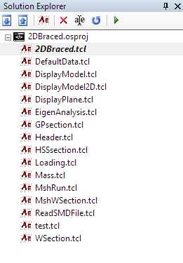
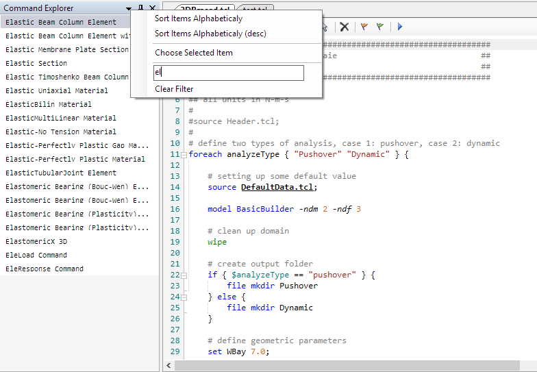

CypressEditor 使用方法
========================

OpenSees官网推荐了一款专门为OpenSees开发的的文本编辑软件 `CypressEditor`_ ，它其中集成了OpenSees的帮助文档，调阅十分方便。且可直接在 `CypressEditor`_ 执行，不需要再单独开启OpenSees。

.. _CypressEditor: http://cypress.hrshojaie.com/en-us/default.aspx

下面介绍 `CypressEditor`_ 的基本使用方法。

下载和安装
----------

登陆 `CypressEditor`_ 的官方网站 ，进入 `Download`_ 页面，选择合适的版本，下载并安装即可。目前 `CypressEditor`_ 仍为测试版，且只有windows版本放出，mac和linux版本的用户，可能还需要再稍作等待。更诱人的是，它是免费的。

.. _Download: http://cypress.hrshojaie.com/en-us/download/latest

安装时，会弹出和OpenSees一样需要填写的机构，姓名，邮箱之类用于收集学术信息。 `CypressEditor`_ 可以被安装在计算机的任意位置，而不需要和OpenSees安装在同一个文件夹下。安装完成后，启动编辑器时，需要输入一个邮箱，来获取激活码，所以一定要填写真实的邮箱。注册成功后，安装就完成了。

.. image:: image/cypress-activate1.png

.. note:: 有些邮箱（如同济大学邮箱）收不到激活码。如果遇到这种情况请更换不同的邮箱。QQ邮箱可以使用。

为了愉快地使用 `CypressEditor`_ ，还需要进行一项操作，为 `CypressEditor`_ 设定OpenSees的安装路径，这是代码能够顺利执行的关键。执行完此项操作，就可以在OpenSees的海洋里徜徉了。

   
常用快捷键
----------

`CypressEditor`_ 提供了非常丰富的快捷键，且和使用其他编译软件和办公软件的快捷键几乎相同，对广大windows用户十分友好，这些快捷键有助于编写OpenSees或其它代码。下面介绍一些主要的快捷键。

- ``ctrl`` + ``Z`` ：撤销输入。
- ``ctrl`` + ``X`` ：剪切。
- ``ctrl`` + ``C`` ：复制。
- ``ctrl`` + ``V`` ：粘贴。
- ``ctrl`` + ``A`` ：全选。
- ``ctrl`` + ``S`` ：保存。
- ``ctrl`` + ``K`` ：如是注释行，则选中整行，如果是非注释行，则在前加“#”变为注释行。
- ``ctrl`` + ``shift``+ ``K`` ：如是命令行，则选中整行，如果是注释行，则将“#”去掉变为命令行。
- ``ctrl`` + ``shift``+ ``alt`` ：列选择模式。
- ``F5`` ：运行命令。

.. note:: 在第一次执行之前，请注意先保存文件。但建立文件以后，每次做出修改时，可以直接运行，而不需要再次保存

工具栏
----------

`CypressEditor`_ 的工具栏与其他软件一致，从左至右依次为新建tcl文件、打开tcl文件、保存tcl文件、打印tcl文件、向前撤销、向后撤销、剪切、复制、粘贴及全选。

通过新建tcl即可以开始编写自己的OpenSees文件啦。

输出
----------

`CypressEditor`_ 在运行命令后，会自动生成一个窗体显示结果，按任意键可以退出该窗体，回到命令编辑窗口。

   
其他功能简要介绍
------------------

`CypressEditor`_ 提供了代码高亮、关键字等功能。

代码高亮：对于OpenSees所使用的主要保留字，提供代码高亮的功能。

关键字：只要输入命令的关键字，就会自动提供可选命令。

参数提示：由于OpenSees每一条命令所需要的参数繁多，难以记忆，所以本只需要输入关键字后，命令即会弹出小窗口，提示其后需要输入的参数，用户只要按提示输入即可。

   
软件右侧的Solution Explorer可以显示所有建立的solution以及所有solution下的tcl文件。

软件左侧的Command Explorer，点击向下的三角箭头，可以迅速查找命令，并调取其帮助文档。

软件下方的 ``Command Help`` ，可以看到调取出的帮助文档，不过除非你的屏幕很大，或者采用双屏，否则看起来相当得费劲，还是建议直接看网页的帮助文档吧。

以上就是 `CypressEditor`_ 的主要功能介绍。如想了解更多，可以登录其官方网站，查看 `帮助文档`_ 。

.. _帮助文档: http://cypress.hrshojaie.com/en-us/help/documentation

