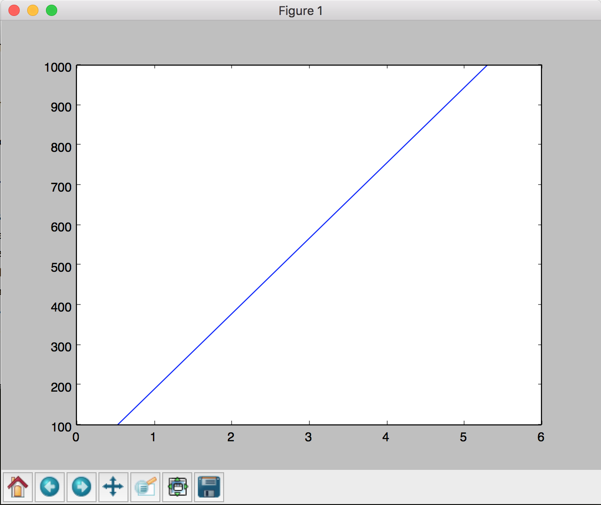
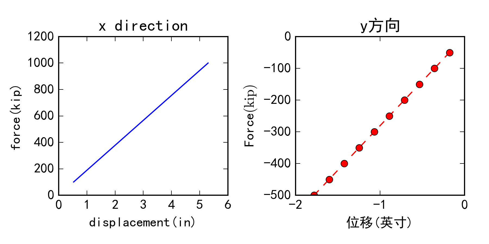

利用matplotlib作图
===========================

对于 ``recorder`` 输出的结果，如果需要用最快的方法观察其力-位移关系，推荐使用 翰林苑_ 结构工具箱_ 中的 后处理工具_ 。但是对于复杂的作图，推荐使用 matplotlib_ 。

.. _翰林苑: http://www.hanlindong.com/
.. _结构工具箱: http://www.hanlindong.com/toolcatalog/
.. _后处理工具: http://www.hanlindong.com/tools/opensees-postprocess-xyfigure/

Python是一门面向对象的解释型语言，其优势在于易学习、易阅读、易扩展。Python现在已经越来越多地用于科学计算中，这得益于很多优秀的Python模块。主要有 numpy_ ， matplotlib_ ， scipy_ 等。比起把OpenSees生成的数据粘贴到excel中再作图，利用 matplotlib_ 作图是一个更方便快捷的选择。更重要的是，相比 matlab_ 高昂的费用， Python的科学计算模块都是开源和免费的。

下面针对Windows用户介绍如何安装和配置 matplotlib_ 作图环境。

.. _numpy: http://www.numpy.org/
.. _matplotlib: http://matplotlib.org/
.. _scipy: http://www.scipy.org/
.. _matlab: http://cn.mathworks.com/index.html?s_tid=gn_loc_drop

安装
------

安装Python
~~~~~~~~~~~~

这里介绍Python2.7的安装。

登陆 `Python2.7下载页面`_ ，在 ``Download`` 部分找到自己系统适合的安装包下载。然后用管理员方式运行安装包完成安装。在出现下图界面时，请注意选择 ``Add python.exe to Path`` ，如下图所示。

.. image:: image/install_python.png

.. warning:: 如果在安装时没有选择这一项，请自行将python.exe所在路径加入环境变量。

.. _Python2.7下载页面: http://www.python.org/downloads/release/python-2712/

安装 ``numpy`` 和 ``matplotlib``
~~~~~~~~~~~~~~~~~~~~~~~~~~~~~~~~~~~~

安装好了python之后，要安装python的科学计算库 numpy_ 和 matplotlib_ 。打开 ``命令提示符`` ，输入::

    pip install numpy

屏幕上会显示安装信息。 ``pip`` 命令会自动从Python项目的包管理中心下载并安装合适版本的模块。如果屏幕出现提示::

    Successfully installed numpy-x.xx.x

则说明安装成功。

按装 ``matplotlib`` 的方法类似。输入::

    pip install matplotlib

看到成功的提示信息，安装完成。

.. note:: 这种安装方法在windows中可能会缺失Fortran编译器，但这并不会影响两个库的使用。

使用Python
------------

Python和 ``matlab`` 、 ``TCL`` （参考 :doc:`tcl` ）类似，都是解释型语言。需要通过 ``脚本`` 来运行。我们用文本编辑器在D盘中新建一个文本文件，（如果没有文本编辑器，请参考： :doc:`sublime` ）。输入以下代码::

    string = "Hello, world!"
    print string

保存在D盘中，命名为 ``hello.py`` 。这样就创建了一个python脚本文件。打开命令提示符，输入::

    D:

切换到D盘。如果建立了其它文件夹，可以用 ``cd`` 命令来切换工作目录，到你的脚本所在的文件夹。然后输入::

    python hello.py

会看到命令提示符中打印了如下内容::

    Hello, world!

说明脚本运行成功。

如果您使用 ``Sublime Text`` 作为文本编辑器，可以在保存文件之后选择 ``Tools`` - ``Build`` 。选择Python，可在底部弹出的对话框中看到输出的内容。

Python语言的学习很简单，这里推荐几个Python的教程：

- `廖雪峰的Python2.7教程`_
- `菜鸟教程Python`_
- 《Python Cookbook》
- `Python官方文档`_
  
.. _廖雪峰的Python2.7教程: http://www.liaoxuefeng.com/wiki/001374738125095c955c1e6d8bb493182103fac9270762a000
.. _菜鸟教程Python: http://www.runoob.com/python/python-tutorial.html
.. _Python官方文档: https://docs.python.org/2/

从实践中学习Python也是一个不错的选择：

- `菜鸟教程-Python 100例`_
- 《Learn Python the Hard Way》
  
.. _菜鸟教程-Python 100例: http://www.runoob.com/python/python-100-examples.html

使用matplotlib
---------------------

我们通过一个实例来介绍matplotlib入门。

在 :doc:`quickstart` 中，我们建立了一个桁架结构的简单模型。这里我们把模型简单修改。将模型中最后的分析命令::

    analyze 1

改成::

    analyze 10

改完后的 :download:`代码下载 <sourcecode/matplotlib.tcl>`

也就是分析10步。每一步的力是 ``pattern`` 中定义的力。此时结构中的力是 :doc:`quickstart` 中的10倍。运行后打开输出文件 ``example.out`` 可以看到如下结果::

    1 0.530093 -0.177894
    2 1.06019 -0.355787
    3 1.59028 -0.533681
    4 2.12037 -0.711575
    5 2.65046 -0.889468
    6 3.18056 -1.06736
    7 3.71065 -1.24526
    8 4.24074 -1.42315
    9 4.77083 -1.60104
    10 5.30093 -1.77894

其中第一列是 ``time`` 在静力分析中可以理解为 ``倍数``，即这一步骤分析结束后结构所受的力是 ``pattern`` 中定义力的倍数。第二列和第三列分别是4号节点在1和2自由度上的位移。下面我们输出水平力-水平位移关系。

在 ``example.out`` 相同的文件夹中建立文件 ``plot.py`` ，在文件中输入如下代码::

    # import two modules and make alias.
    import numpy as np
    import matplotlib.pyplot as plt

    # read data matrix from file
    data = np.loadtxt("example.out")

    # plot data
    plt.figure()

    # data[:, 0] means the first column of data matrix
    plt.plot(data[:, 1], data[:, 0] * 100)

    # show plot
    plt.show()

:download:`plot.py代码下载 <sourcecode/plot.py>`

运行这一脚本，可以看到以下对话框弹出。

这样，如果OpenSees程序发生变化，生成新的结果后，直接运行这一脚本，就可以查看变化。

更加复杂地，如果同时输出两个图，描述两个方向的力-位移关系，代码如下::

    # -*- coding: utf-8 -*-
    # 支持中文的编码方式

    import numpy as np
    import matplotlib.pyplot as plt
    import matplotlib as mpl

    # 设置中文字体
    mpl.rcParams['font.sans-serif'] = ['SimHei']
    mpl.rcParams['axes.unicode_minus'] = False

    data = np.loadtxt("example.out")

    # 设置图像大小。单位：英寸
    plt.figure(figsize=(6, 3))

    # subplot 1
    plt.subplot(1, 2, 1)

    # 画线
    plt.plot(data[:, 1], data[:, 0] * 100)

    # 设置坐标轴的范围
    plt.xlim([0, 6])
    plt.ylim([0, 1200])

    # 设置坐标轴标题
    plt.xlabel("displacement(in)")
    plt.ylabel("force(kip)")

    # 设置子图标题
    plt.title("x direction")

    # subplot 2
    plt.subplot(1, 2, 2)

    # 设置画线的颜色、标记和线型
    plt.plot(data[:, 2], data[:, 0] * -50, "ro--")

    # 中文坐标轴标题
    plt.xlabel(u"位移(英寸)")

    # 加入LaTeX公式的文字
    plt.ylabel(r"Force$(\mathrm{kip})$")

    plt.title(u"y方向")  

    # 设置横坐标分隔
    plt.xticks([-2, -1, 0])
    plt.yticks([-500, -400, -300, -200, -100, 0]) 

    # 调整布局尺寸
    plt.subplots_adjust(bottom=0.2, top=0.85, left=0.12, right=0.95,
                        wspace=0.4, hspace=0.2)

    # 保存图片
    plt.savefig("myfigure", dpi=300)

:download:`plot2.py代码下载 <sourcecode/plot2.py>`

在当前目录下可以看到生成了一个名为 ``myfigure.png`` 的图像文件，如下图

会用 ``matlab`` 作图的读者可以发现，这个库的使用方法与之非常相似！

更多相关教程，请参照：

- `matplotlib tutorial`_
- `matplotlib tutorial译`_
- `matplotlib gallery`_
- `numpy 官方文档`_
- `matplotlib 官方文档`_
  
.. _matplotlib tutorial: http://www.labri.fr/perso/nrougier/teaching/matplotlib/
.. _matplotlib gallery: http://matplotlib.org/gallery.html
.. _matplotlib tutorial译: http://phddreamer.blog.163.com/blog/static/18993409620135394944504/
.. _matplotlib 官方文档: http://matplotlib.org/contents.html
.. _numpy 官方文档: https://docs.scipy.org/doc/numpy/