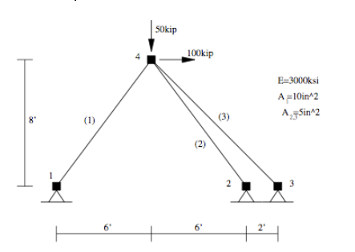
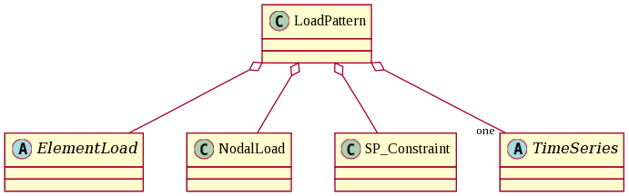

第一个OpenSees脚本
====================

接下来我们将用Opensees帮助文档中给的一个简单例子来说明OpenSees的使用。
该例子是一个线弹性平面桁架静力分析，你可以在帮助文档中看到它，查看原网页请点击 `此处`_ 。

.. _此处: http://opensees.berkeley.edu/wiki/index.php/Basic_Truss_Example

接下来我们将分为建立模型、创建分析、输出设定、运行四部分来做解释。

建立模型
---------

在这一步里，我们要建立结构的模型，包括模型说明、创建节点与约束、定义材料、划分单元和施加荷载等。

1.清空数据库与模型说明 ::

  # units: kip, in 单位
  wipe                # 清除程序之前输入的数据
  model BasicBuilder -ndm 2 -ndf 2  #维数2，自由度2

Opensees中的注释以 ``#`` 开头，程序默认不执行该语句。注释语句作用是增强程序的可读性
在分析程序之前，需要确定结构的自由度规定。 ``model BasicBuilder`` 用于规定结构的维数和自由度数。
-ndm后填写维数，-ndf后填写自由度数（不要忘记“-”符号）。这里由于是分析二维平面桁架，每个节点只有两个自由度（即平动自由度）        

2.创建节点::

   node 1   0.0  0.0   # 输入4个节点坐标
   node 2 144.0  0.0
   node 3 168.0  0.0
   node 4  72.0 96.0

命令中 ``#node`` 为定义节点命令，帮助文档中该命令参数如下::

   node $nodeTag (ndm $coords) <-mass (ndf $massValues)> 

即：node 节点编号 节点坐标 <-mass 每个自由度上的节点质量（最多6个,与上条命令输入的结构自由度对应）>
由于是平面二维静力分析，不需要定义节点质量 

3.创建约束::

  fix 1 1 1   # 约束xy两方向的位移
  fix 2 1 1
  fix 3 1 1

命令中 ``fix`` 为定义节点约束命令，帮助文档中该命令参数如下::

    fix $nodeTag (ndf $constrValues)

即： fix 节点编号 1号自由度的约束值 2号自由度的约束值 ... 6号自由度的约束值
约束值可选为0，即无约束，或者1，即完全约束。

4.创建材料::

  uniaxialMaterial Elastic 1 3000   # 单轴完全弹性材料，定义为材料1，弹性模量为3000kip/(in*in)

命令中 ``uniaxialMaterial`` 用以创建一个单轴材料属性，可以表示单轴应力-应变或者力-位移关系。
帮助文档中该命令参数如下::

    uniaxialMaterial matType? matTag? arg1? ...

即：uniaxialMaterial 材料种类 材料编号 参数1 参数2...
Opensees提供了丰富的 `材料库`_ ，随着材料种类选择不同，材料号后面的参数个数也不同，具体见 `材料库`_ 。

.. _材料库: http://opensees.berkeley.edu/wiki/index.php/UniaxialMaterial_Command

5.划分单元::

  element Truss 1 1 4 10.0 1    #单元类型为桁架 单元编号1 起始节点编号1 终止节点编号4 横截面积 材料编号
  element Truss 2 2 4 5.0 1
  element Truss 3 3 4 5.0 1

命令中 ``element`` 用以定义节点形成的单元
帮助文档中该命令参数如下：element eleType? arg1? ... 
即：element 单元类型 单元编号 参数1 参数2...
Opensees提供了丰富的 `单元库`_ ，随着单元种类选择不同，单元编号后面的参数个数也不同，具体见 `单元库`_ 。

.. _单元库: http://opensees.berkeley.edu/wiki/index.php/Element_Command

6.施加荷载::

  timeSeries Linear 1  #线性加载方式，斜率为1。即当time=0时，荷载为0，time=1.0时，荷载达到设定值
  pattern Plain 1 1 {
  	
     load 4 100 -50        #在4节点上施加节点荷载向右100kip，向下50kip。
  }

命令中， ``timeSeries`` 用于定义荷载的施加方式。随着分析步的进行（time的增大），荷载的变化情况。
帮助文档中该命令的参数如下::

    timeSeries Linear $tag <-factor $cFactor>

即：timeSeries 加载类型 参数。上文中的Linear可以改为constant或者rectangular分别代表常荷载，突加荷载等。
具体见帮助文档 `timeSeries`_ 。

.. _timeSeries: http://opensees.berkeley.edu/wiki/index.php?title=Special%3ASearch&search=timeSeries&go=Go

每一个 ``timeSeries`` 命令都对应一个 ``pattern`` 命令， ``pattern`` 与 ``timeseries`` 的关系如下图所示。

``pattern`` 用于定义荷载的类型工况。

帮助文档中该命令的参数如下::

    pattern patternType? arg1? ...

即：pattern 荷载类型 参数...
工况类型主要有静力荷载、均匀激励荷载（如地震加速度），多种激励荷载等。静力荷载包含了静力分析中所有可能遇到的荷载类型。
静力荷载工况下的参数如下::

    pattern Plain $patternTag $tsTag <-fact $cFactor> {  load...  eleLoad...  sp...  ... }

即： pattern 荷载模式编号 timeSeries编号 节点荷载 单元荷载 面荷载 ...
 
创建分析
----------

在这一步里，我们要设定分析的参数，包括选择求解方式、迭代算法、约束、分析类型、荷载增量步等。这一部分建议直接参看帮助文档相应内容寻找适合自己的参数。::

   system BandSPD
   numberer RCM
   constraints Plain  #采用乘大数法处理边界条件
   algorithm Linear   #迭代算法采用线性法，一般用于处理弹性结果
   analysis Static    #结构计算为静力分析

命令 ``system`` 用于定义线性求解器的特性从而选择合适的方程矩阵带宽处理方法。例如刚度矩阵具有带状（banded）、对称（symmetric）、正定（positive definite）特点，那么可以采用BandSPD，从而减少占用内存，提高求解效率。
帮助文档中该命令的参数如下::

    system systemType? arg1? ...

即：system 求解器类型 参数... 
具体的线性求解器类型和参数可以参看帮助文档关于 `system`_ 命令的解释。

.. _system: http://opensees.berkeley.edu/wiki/index.php/System_Command

``numberer`` 用于定义节点自由度与有限元方程的映射关系。这里比较复杂，以后还会介绍。
一般结构采用plain，即按照输入节点的顺序编号，最直接。
对于此例桁架只有轴力一个分量，刚度矩阵稀疏，采用 `RCM`_ 方式可以减少稀疏矩阵带宽，提高计算效率。

.. _RCM: http://dl.acm.org/citation.cfm?id=805928

帮助文档中该命令的参数如下::

    numberer numbererType? arg1? ...

即：numberer 编号器类型 参数... 
具体的编号器类型和参数可以参看帮助文档关于 `numberer`_ 命令的解释。

.. _numberer: http://opensees.berkeley.edu/wiki/index.php/Numberer_Command

``constraints`` 用于定义边界条件的处理方式，一般处理方式为乘大数法。
帮助文档中该命令的参数如下::

    constraints constraintType? arg1? ...

即：constraints 边界处理方式 参数...  
其他处理方式和参数可以参看帮助文档关于 `constraints`_ 命令的解释。

.. _constraints: http://opensees.berkeley.edu/wiki/index.php/Constraints_Command

``algorithm`` 用于定义迭代算法。
帮助文档中该命令的参数如下::

    algorithm algorithmType? arg1? ...

即：algorithm 边界处理方式 参数... 
对于不同类型的问题，选择合适的迭代算法很重要。尤其对于较复杂结构，合适的算法可以提高求解效率或避免陷入局部极值。
求解算法和参数可以参看帮助文档关于 `algorithm`_ 命令的解释。

.. _algorithm :  http://opensees.berkeley.edu/wiki/index.php/Algorithm_Command

``analysis`` 用于定义分析类型。
帮助文档中该命令的参数如下::

    analysis analysisType?

即：analysis 分析类型
Opensees中分析类型有三种。静力分析、等步长瞬态分析、变步长瞬态分析。静力学问题，使用静力分析；在动力学问题中，结构频率不变的情况下，往往可以使用等步长瞬态分析，步长小于其增量即可捕捉到比较准确光滑的荷载—位移关系，步长选取太大可能会漏掉一些状态。关于步长的选取和变步长瞬态分析，以后再讲。

输出设定
----------

在开始运行前，要提前设定好需要输出的内容，以获得我们需要的结果。::

  recorder Node -file example.out -time -node 4 -dof 1 2 disp   #记录加载点的水平和竖直位移
  recorder Element -file eleGlobal.out -time -ele 1 2 3 forces  #记录1、2和3号单元整体坐标下的轴力
  recorder Element -file eleLocal.out  -time -ele 1 2 3 basicForces #记录1、2和3号单元局部坐标下的轴力

命令 ``recorder`` 用于设定输出数据，这是非常重要且参数很多的一个命令。
帮助文档中该命令的参数如下::

    recorder recorderType? arg1? ...

即： recorder 记录类型 参数...
记录类型包括节点（node）、单元（element）等，还可以将节点或单元的结果绘图显示。
这里介绍一下 ``recorder node`` 后的参数意义。该命令参数完整如下::

    recorder Node <-file $fileName> <-xml $fileName> <-binary $fileName> <-tcp $inetAddress $port> <-precision $nSD> <-timeSeries $tsTag> <-time> <-dT $deltaT> <-closeOnWrite> <-node $node1 $node2 ...> <-nodeRange $startNode $endNode> <-region $regionTag> -dof ($dof1 $dof2 ...) $respType'

 ``<  >`` 中的参数，往往不是必须填写，只有在输入 ``-`` 后的内容时，才会引用。如编辑 -file 则引用 ``<-file $fileName>`` 内容，并填写 ``$fileNmme`` ，$后面的内容是自定义内容，可以根据自己的需要进行修改。
 将常用参数列出，其他请参看帮助文档关于 `recorder`_ 命令的解释。

 .. _recorder : http://opensees.berkeley.edu/wiki/index.php/Node_Recorder
 
 - ``<-file $fileName>`` 设定输出文本文件名（带后缀）-xml、-binary为不同文件类型
 - ``<-time>`` 记录分析时间，一般静力加载采用线性加载方式，随着时间增大将荷载加到目标值。注意这里的时间不是一个绝对量（如计算时间），而是相对量（如以0表示分析开始，1表示荷载施加完毕）。
 - ``<-node $node1 $node2 ...>`` 选择输出的节点号
 - ``<-dof ($dof1 $dof2 ...)>``  输出节点的自由度
 - ``<$respType>``               设定输出值。可选量为位移、速度、加速度等。
 
运行
----------

设定好之后，即可用运行命令运行。 ``analyze`` 用于运行分析，帮助文档中该命令的参数如下::

    analyze $numIncr <$dt> <$dtMin $dtMax $Jd>

即： analyze 分析步数 <步长增量> <最小步长 最大步长 最大分析步数> ``<>`` 中的参数只需要在动力分析中输入，静力分析可不选::

  analyze 1   #分析荷载总步数为1

至此，一个完整的Opensees程序已经分析完毕，通过这个例子，相信你对Opensees的操作流程也有了基本的了解。有了这样一个知识框架作为铺垫，日后只需要通过对阅读帮助文档，就可以很快投入到实际使用中。

本例 :download:`源代码下载 <sourcecode/quickstart.tcl>`

