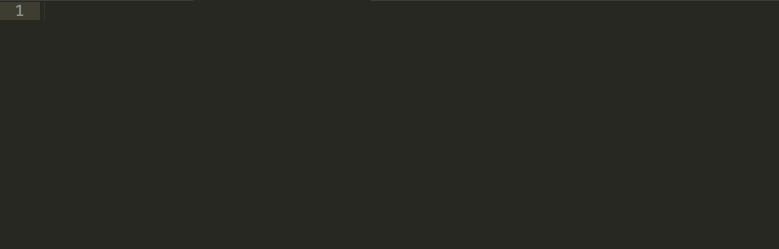

.. _Sublime Text 3 使用方法:

Sublime Text 3 使用方法
========================

本教程推荐使用 `Sublime Text 3`_ 作为OpenSees命令编辑器。Sublime Text 3支持Windows, Mac和Linux平台，其免费版本除了保存一定次数后会跳窗提示未注册外，其余功能与注册版本没有区别。相似的编辑器替代品还有Windows平台下的 `Notepad++`_ , UltraEdit_ ，Mac平台下的 TextMate_ 以及终端编辑器 Vim_ 等。

下面介绍 `Sublime Text 3`_ 的基本使用方法。

.. _Sublime Text 3: http://www.sublimetext.com/
.. _`Notepad++`: https://notepad-plus-plus.org/
.. _UltraEdit: http://www.ultraedit.com/
.. _TextMate: http://macromates.com/
.. _Vim: http://www.vim.org/

下载和安装
----------

登陆 `Sublime Text 3`_ 的官方网站 ，进入 `Download`_ 页面，选择合适的版本，下载并安装即可。目前 `Sublime Text 3`_ 仍为测试版，但是其功能已经比较完善，所以建议不要使用旧版本。您下载免费版本拥有 `Sublime Text 3`_ 的所有功能。与付费版本唯一的不同是，每保存一定次数会弹出对话框建议购买。如果这对您造成困扰，建议购买付费版本。

.. _Download: http://www.sublimetext.com/3

常用快捷键
----------

``Sublime Text`` 提供了非常丰富的快捷键，十分有助于编写OpenSees或其它代码。下面介绍一些主要的快捷键。


- ``cmd`` + ``D`` ：选择重复内容。这在修改相近的重复内容时十分有用。
- ``cmd`` + ``U`` ：如果 ``cmd`` + ``D`` 不小心多按了一次，可以取消上一次的选择。
- ``cmd`` + ``L`` ：在光标所在的位置选择整行。
- ``cmd`` + ``shift`` + ``L`` ：把选择好各行的一个区域按行分解为多个区域。
- ``cmd`` + ``shift`` + ``D`` ：复制整行。
- ``cmd`` + ``/`` ：注释和取消注释
- ``cmd`` + ``左右箭头`` ：从光标起选择到行尾。
- ``cmd`` + ``control`` + ``上下箭头`` ：把行与相邻行对调位置。
- ``alt`` + ``鼠标左键`` ：列块选择模式。

以下是在编辑OpenSees代码过程中经常使用到的快捷键。还有很多好用的快捷键，用户可以参考以下文章。

- `Sublime Text Unofficial Documentation`_ (英文，官方推荐的“非官方”文档)
- `Sublime Text 3 快捷键总结`_ 

.. _Sublime Text Unofficial Documentation: http://docs.sublimetext.info/
.. _Sublime Text 3 快捷键总结: https://www.douban.com/note/362268947/


Package Control
----------------

安装
~~~~~~

``Sublime Text`` 的扩展性能非常强，有一个非常方便的插件包管理工具 `Package Control`_ 。几乎所有用户都会使用 `Package Control`_ 来管理自己的插件。强烈建议安装 `Package Control`_ 。

安装 `Package Control`_ 非常简单，您只需要打开其 `安装页面`_ ，将其中的代码复制，再回到 ``Sublime Text`` 中，从 ``View`` - ``Show Console`` 中（或按下 ``control`` + ``\``` ） 打开控制台，粘帖，按回车执行，就安装好了 `Package Control`_ 

.. _Package Control: https://packagecontrol.io
.. _安装页面: https://packagecontrol.io/installation

使用方法
~~~~~~~~~

``Package Control`` 要从 ``Sublime Text`` 的 ``Command Palette`` 中运行。点击 ``Tools`` - ``Command Palette`` 弹出命令面板。在命令面板中输入 ``Package`` 就可以看到全部与 ``Package Control`` 有关的命令了。其中主要有

- Install Package: 安装插件包。执行后看左下角的状态栏中显示正在搜索，过几秒钟后在命令面板中就会显示出一个列表，这个列表就是所有可用的插件。从列表中选择所需要的插件，单击就会自动安装。这些插件是托管在Github上的开源项目，所以需要联网才能安装。
- List Packages: 列出当前所有安装的插件。
- Disable Package: 禁用某个插件.

下面我们就可以利用 ``Package Control`` 来安装我们所需要的插件了。下文中我将介绍与OpenSees编程有关的主要插件。


Sublime-OpenSees
-----------------

`Sublime-OpenSees`_ 是一个专门针对OpenSees用户所提供的插件包。这个插件可以帮助用户快速的输入OpenSees代码。该插件主要有如下几个功能

- 代码高亮：对于OpenSees所使用的主要保留字，提供代码高亮的功能。
- 自动补全：由于OpenSees每一条命令所需要的参数繁多，难以记忆，所以本插件提供自动补全功能。用户只需要输入主要的关键字，就会自动提供可选命令，并给予所需要输入的参数的相应参考。这一功能可以极大的提高代码的编写速度。
- 在 ``Sublime Text`` 内部提交代码执行分析。这个功能是用户只需要简单的快捷键就可以执行OpenSees代码，而不需要切换到控制台中，可以提高工作效率。

下面介绍一下 `Sublime-OpenSees`_  的安装方法。按照上一小节中 ``Install Package`` 的使用方法，从弹出的插件列表中找到 ``OpenSees`` ，即可完成安装。

在使用中，首先新建一个空白文档，找到 ``Command Palette`` ，输入 ``SSOP`` ，或者其他简写的字符串，找到 ``Set Syntex: OpenSees Input`` 一项，即可设定该文档的语言为OpenSees。这时输入代码的时候，对于OpenSees关键字，系统就会做高亮处理。与上一章相同，我们在文档中输入 ::
    
    puts "Hello, OpenSees!"

可以看到，代码中的 ``puts`` 被高亮处理了。

下面我们试着在 ``Sublime Text`` 中直接执行OpenSees代码。点击 ``Tools`` - ``Build`` 或者快捷键 ``cmd`` + ``B`` ，就弹出了 ``Build选项`` 。选择 ``OpenSees`` 会发现程序底部弹出了一个窗口，输出了如下内容 ::
    
        [RUN OpenSees Sequential for "untitled.tcl" Started]


             OpenSees -- Open System For Earthquake Engineering Simulation
                     Pacific Earthquake Engineering Research Center
                            Version 2.5.0 (rev 6228) 32-Bit

          (c) Copyright 1999-2016 The Regents of the University of California
                                  All Rights Reserved
      (Copyright and Disclaimer @ http://www.berkeley.edu/OpenSees/copyright.html)


    Hello, OpenSees!


    [RUN OpenSees Sequential for "untitled.tcl" Finished in 0.1s]

说明该代码已经被OpenSees成功执行。

有关代码补全，演示如下




其它推荐使用的包
----------------------

Increment Selection
~~~~~~~~~~~~~~~~~~~~~~

`Increment Selection`_ 是一个快速创建连续整数的插件，这在OpenSees编程中很常见。


上图中使用的快捷键：

- `cmd` + `shift` + `D` ：复制整行
- `cmd` + `箭头` ：选择到行首/首行
- `cmd` + `shift` + `L` ：分割选择到列
- `shift` + `箭头` ：选择相邻字母
- `cmd` + `control` + `I` ：Increment Selection

.. _Increment Selection: https://github.com/yulanggong/IncrementSelection/

Super Calculator
~~~~~~~~~~~~~~~~~~~~~~

`Super Calculator`_ 可以帮助你把输入的算式计算出结果。


ConvertToUTF8
~~~~~~~~~~~~~~~~~~~~~

如果你想打开的文本文件中包含有中文，由于编码问题， ``Sublime Text`` 有可能会显示乱码。安装了 `ConvertToUTF8`_ 之后，可以在打开文本文件几秒钟之内将编码转换成正确的编码。
